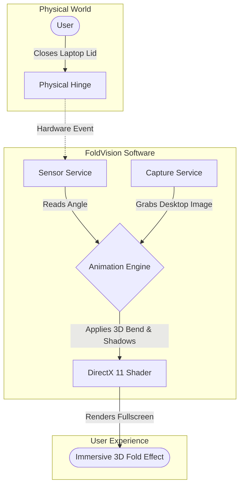
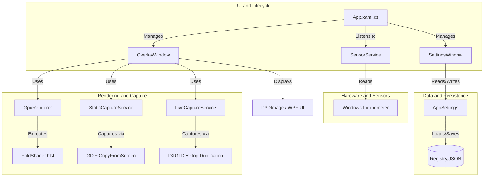
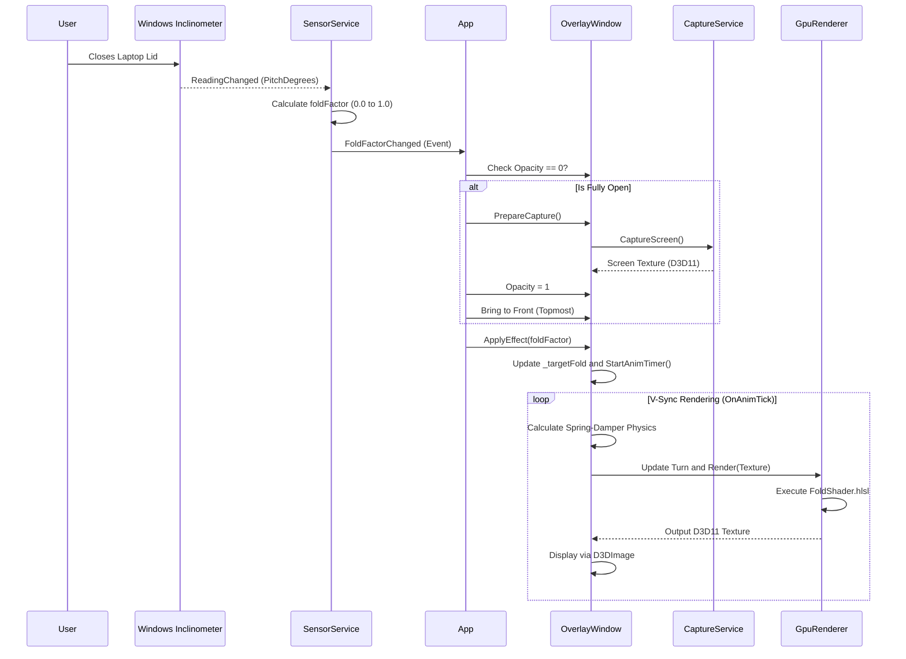

# FoldVision Architecture & Technical Documentation

This document explains the internal architecture, component interactions, and technical design of FoldVision.

## 🎯 Functional Objective & User Journey

The primary functional objective of FoldVision is to seamlessly bridge the physical movement of a laptop lid with a digital, immersive UI effect. When a user physically closes their device, the application instantly grabs a snapshot of the current desktop and applies a real-time 3D folding distortion. This creates the illusion that the Windows desktop itself is physically folding like a book.



## 🧩 Component Diagram

The following diagram illustrates the high-level architecture and how the primary components interact.



## 🔄 Sequence Diagram: The Fold Effect Lifecycle

The core behavior of FoldVision is triggered when the user closes their laptop lid. Here is the exact sequence of events that occurs under the hood.



## 📂 Core Components Deep Dive

### 1. `SensorService.cs`
Responsible for talking to the physical hardware.
- It runs a background thread that polls the `Windows.Devices.Sensors.Inclinometer`.
- The inclinometer provides raw hardware degrees (pitch).
- It normalizes these degrees into a `foldFactor` between `0.0` (fully open) and `1.0` (fully closed), ensuring that the software remains hardware-agnostic for different hinge designs.

### 2. `OverlayWindow.xaml.cs`
The visual canvas of the application.
- It is a highly specialized WPF window configured with `WS_EX_TRANSPARENT` and `WS_EX_LAYERED`, making it completely invisible to mouse clicks (click-through).
- To prevent a recursive hall-of-mirrors effect (Droste effect) when taking screenshots, it utilizes `WDA_EXCLUDEFROMCAPTURE`.

### 3. `Capture Services`
To create the illusion of the screen folding, the app must capture whatever is currently on the user's desktop.
- **`StaticCaptureService.cs`:** Used in "Static Mode". It uses the DirectX `IDXGIOutputDuplication` API (via DXGI) to capture a single, instantaneous photograph of the screen directly on the GPU exactly 1 millisecond before the `OverlayWindow` becomes visible, ensuring zero CPU bottleneck. It is highly battery efficient because it only captures the screen once per fold and then releases the DXGI context.
- **`LiveCaptureService.cs`:** Used in "Live Mode". It uses the DirectX `IDXGIOutputDuplication` API to continuously stream the desktop at 60 FPS directly to the GPU. This allows video and animations to continue playing seamlessly while the screen is folded.

### 4. `GpuRenderer.cs` & `FoldShader.hlsl`
The heavy lifting of the visual effect.
- **`GpuRenderer`:** Sets up the Direct3D 11 environment using Vortice. It creates the Vertex Buffers, Samplers, and Constant Buffers needed to communicate with the GPU.
- **`FoldShader.hlsl`:** A custom Pixel Shader that receives the flat 2D screen texture and a `Turn` parameter. It mathematically remaps the 2D UV coordinates into a 3D perspective to simulate a real folded screen. It also dynamically calculates:
  - Perspective distortion.
  - A multi-pass directional Gaussian blur to simulate depth of field.
  - Dynamic gradient shadowing that darkens the "crease" of the fold as the angle gets sharper.

### 5. `App.xaml.cs`
The orchestrator.
- Ensures only one instance of the app runs at a time using a `Mutex`.
- Hides the application in the System Tray (NotifyIcon).

---

## 🎬 Deep Dive: The Animation Engine

The animation engine in FoldVision is what makes the effect feel premium and physically grounded. It does not blindly snap the visual effect to the raw data provided by the hardware sensor.

1. **The V-Sync Rendering Loop:**
   Inside `OverlayWindow.xaml.cs`, the animation hooks into WPF's `CompositionTarget.Rendering` event. This synchronizes the animation heartbeat precisely with the monitor's refresh rate (V-Sync), ensuring buttery-smooth execution whether running at 60Hz, 120Hz, or 144Hz.

2. **The Target vs. Current Fold Factor:**
   When the lid closes, `SensorService` emits a new `foldFactor` (between `0.0` and `1.0`). This value is stored in `_targetFold`. The actual visual state of the fold is stored in `_currentFold`.

3. **Framerate-Independent Physics Algorithm:**
   At every render tick, the engine calculates the exact `dt` (delta time) since the last frame. It applies Hooke's Law (Spring tension) and velocity friction (Damper) using this `dt`, making the physics independent of the framerate.
   ```csharp
   float springForce = SpringTension * (_targetFold - _curTurn) - SpringDamping * _turnVelocity;
   _turnVelocity += springForce * dt;
   _curTurn      += _turnVelocity * dt;
   ```
   This means if you slam the laptop lid shut quickly, the `_currentFold` variable will briefly overshoot `_targetFold`, causing a visual "bounce" or "wobble", exactly like physical inertia. 

4. **Triggering the GPU:**
   After the new `_currentFold` is calculated, it is passed to the `GpuRenderer` as the `Turn` parameter. The HLSL shader is executed, outputting a new frame on the WPF `D3DImage`.

---

## 🐛 Bug Fixes & Edge Case Handling

Building FoldVision required solving several complex OS-level challenges. Below are the key architectural decisions made to fix critical bugs:

### 1. Z-Order & Settings Window Conflicts
**The Bug:** If the user opened the `SettingsWindow` and then closed the laptop lid, the `OverlayWindow` would sometimes lose Topmost priority, stop animating, or the entire application screen would freeze.
**The Fix:** A strict lifecycle rule was implemented in `App.xaml.cs`. If the lid starts closing (`foldFactor > 0`) while the `SettingsWindow` is currently open, the app invokes `RestartEffectService()`. This gracefully destroys the old `OverlayWindow`, creates a brand new one completely on top of everything, and injects the latest parameters to ensure 0 freezing.

### 2. Concurrency during Screen Capture (GDI+)
**The Bug:** In "Static Mode", taking a screenshot using `Graphics.CopyFromScreen` while the lid was closing rapidly could cause race conditions. If the thread tried to capture the screen at the exact same time the GPU was initializing, it resulted in `E_ACCESSDENIED` or silent crashes.
**The Fix:** The screen capture logic was made fully synchronous and strictly ordered. We ensured that `InitGpu()` finishes execution during the `OnLoaded` lifecycle event, well before any screen capture is attempted.

### 3. Droste Effect (Infinite Mirror)
**The Bug:** When the app captured the screen, it accidentally captured its own visual output. The next frame would capture the previous frame, creating an infinite mirror tunnel.
**The Fix:** `NativeMethods.SetWindowDisplayAffinity(hwnd, WDA_EXCLUDEFROMCAPTURE)` is applied inside `OnLoaded()`. This tells the Windows Desktop Window Manager (DWM) to hide the window exclusively from screen capture APIs, making the overlay invisible to its own screenshots.
