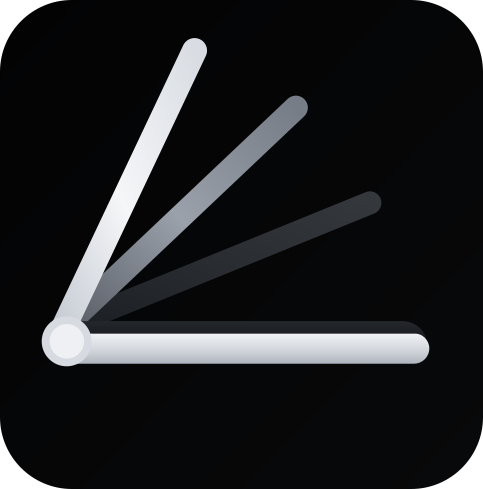

  
  <h1>FoldVision ✨</h1>
  

 

| 🇨🇴 🇪🇸 Español (Spanish) | 🇬🇧 🇺🇸 English (Inglés) |
| --- | --- |
| **FoldVision** Lleva la experiencia de pliegue inmersivo del iPhone Duo a la pantalla de tu laptop con Windows.  ⚠️ **Requisito:** Funciona *exclusivamente* en portátiles equipados con un **Inclinómetro** por hardware (ej. Microsoft Surface Laptop Studio o Lenovo Yoga Book). *Este sensor combina datos de giroscopios y acelerómetros físicos, permitiendo a Windows calcular el ángulo exacto de la bisagra.*  | **FoldVision** Bring the immersive folding experience of the iPhone Duo to your Windows laptop screen.  ⚠️ **Requirement:** Works *exclusively* on laptops equipped with a hardware **Inclinometer** (e.g., Microsoft Surface Laptop Studio or Lenovo Yoga Book). *This sensor combines data from physical gyroscopes and accelerometers, allowing Windows to calculate the exact hinge angle.*  

<b>🇨🇴 🇪🇸 Documentación en Español</b>

 

### 🚀 Características Principales
- **Efecto D3D11 Acelerado por Hardware:** Renderizado ultrarrápido a través de GPU que garantiza 0 latencia y no consume casi recursos del procesador (CPU).
- **Sensor Inteligente Integrado:** Detecta automáticamente el grado de inclinación de la bisagra nativamente mediante el Inclinómetro de Windows (Hardware requerido).
- **Dos modos de funcionamiento:**
  - **Modo Estático (Bajo consumo)**
  - **Modo Live (Tiempo real - Overlay)**
- **Personalizable:** Incluye una interfaz (accesible mediante el icono oculto de la barra de tareas) para personalizar el desenfoque (blur), profundidad, sombras y límites de activación.

### 🛡️ Privacidad y Seguridad
FoldVision es una herramienta de código abierto **100% segura, gratuita y privada**, creada simplemente porque [*YOLO*](https://www.youtube.com/watch?v=pT68FS3YbQ4).
- **Sin conexión a internet:** La aplicación funciona de manera completamente local (offline) y no realiza ninguna petición a la red.
- **Cero telemetría:** No recolecta, almacena, ni envía absolutamente ningún tipo de dato personal, de hardware o métrica de uso.
- **Transparencia total:** Al ser Open Source, cualquier persona puede inspeccionar el código fuente para verificar su seguridad.

### ⚙️ Cómo empezar
Puedes descargar la versión que prefieras desde la [sección de Releases en GitHub](https://github.com/beymans-code/fold-vision-windows/releases):
- **Instalador (`FoldVision_Setup.exe`):** Recomendado para la mayoría de usuarios.
- **Versión Portable (`FoldVision_Portable.exe`):** Un único archivo ejecutable que no requiere instalación.

*Importante: Al ser archivos sin firma digital, el Control Inteligente de Aplicaciones o SmartScreen de Windows podría mostrar una advertencia. Para evitarlo, haz **clic derecho** en el archivo descargado > **Propiedades** > marca la casilla **Desbloquear** en la parte inferior y haz clic en Aplicar antes de ejecutarlo.*

*Siéntete libre de analizar el ejecutable con VirusTotal; si arroja algún reporte de app maliciosa, ten por seguro que es solo un **FALSO POSITIVO**.*

*No quiero pagar por un certificado digital para firmar la aplicación, así que ALV 🖕🏽 con Microsoft y sus firmas digitales.*

Si prefieres descargar el código fuente y compilarlo tú mismo, es muy fácil:
1. Asegúrate de tener instalado el SDK de **.NET 8**.
2. Haz doble clic en el script `build_release.bat`.
3. Esto generará la carpeta `publish\FoldVision\` con los archivos compilados.
4. Puedes ejecutar `FoldVision.exe` directamente desde ahí, o usar Inno Setup con el archivo `installer.iss` para crear tu propio instalador.
5. Al abrir `FoldVision.exe`, el programa se ocultará en la barra de tareas (abajo a la derecha). Haz doble clic en el icono  `FoldVision` para abrir los ajustes.

### 📜 Licencia
Este proyecto es completamente de código abierto y se distribuye bajo la **Licencia Pública General GNU (GPLv3)**. Tienes total libertad para estudiarlo, modificarlo y compartir tus mejoras. Consulta el archivo `LICENSE` adjunto para más información.

---

<b>🇬🇧 🇺🇸 Documentation in English</b>

 

### 🚀 Key Features
- **Hardware-Accelerated D3D11 Effect:** Blazing-fast GPU rendering that ensures 0 latency with almost zero CPU overhead.
- **Smart Built-in Sensor:** Automatically detects the exact tilt angle of the hinge natively using the Windows Inclinometer (Hardware required).
- **Two operating modes:**
  - **Static Mode (Low power)**
  - **Live Mode (Real-time - Overlay)**
- **Customizable:** Comes with a GUI (accessible from the system tray) to tweak the blur strength, depth, shadowing, and activation limits.

### 🛡️ Privacy & Security
FoldVision is an open-source tool that is **100% safe, free, and private**, built simply because [*YOLO*](https://www.youtube.com/watch?v=pT68FS3YbQ4).
- **No internet connection required:** The application works completely locally (offline) and does not make any network requests.
- **Zero telemetry:** It does not collect, store, or send absolutely any personal data, hardware information, or usage metrics.
- **Full transparency:** Being Open Source, anyone can inspect the source code to verify its safety.

### ⚙️ Getting Started
You can download your preferred version from the [GitHub Releases section](https://github.com/beymans-code/fold-vision-windows/releases):
- **Installer (`FoldVision_Setup.exe`):** Recommended for most users.
- **Portable Version (`FoldVision_Portable.exe`):** A single executable file that requires no installation.

*Important: Since these are unsigned files, Windows SmartScreen or Smart App Control might show a warning. To prevent this, **right-click** the downloaded file > **Properties** > check the **Unblock** box at the bottom and click Apply before running it.*

*You are welcome to scan the executable with VirusTotal; if it shows any malicious app reports, rest assured it is just a **FALSE POSITIVE**.*

*I don't want to pay for a digital certificate to sign the application, so ALV 🖕🏽 with Microsoft and their digital signatures.*

If you prefer to download the source code and build it yourself, it's very straightforward:
1. Make sure you have the **.NET 8** SDK installed.
2. Double-click the `build_release.bat` script.
3. This will generate a `publish\FoldVision\` folder containing the compiled files.
4. You can run `FoldVision.exe` directly from there, or use Inno Setup with the `installer.iss` file to build your own installer.
5. When you open `FoldVision.exe`, it will hide in your system tray (bottom right corner). Double-click the  `FoldVision` icon to open the settings.

### 📜 License
This project is completely open source and is distributed under the **GNU General Public License (GPLv3)**. You have absolute freedom to study, modify, and share your improvements. Please see the attached `LICENSE` file for more details.

